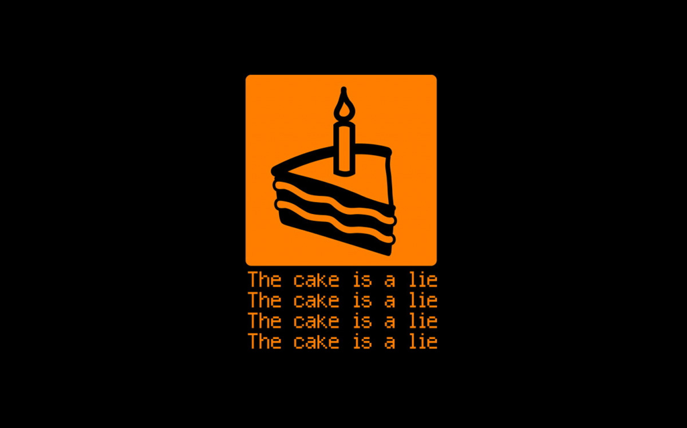

# Bolos Boulos
Trabalho de Programação Orientada a Objeto ministada pela professora Flávia Bernardini - UFF

**Alunos:** Artur Ladeira; Bárbara Ramos; Catherine Costa; Davi Chalita; Giovane Lopes; José Paulo Gomes; Matheus Baldissara; Samir Saadi

## Relatório

### Baixando repositório
```bash
git clone https://github.com/ArturLadeiraAndrade/trabalho_POO.git
```

### Técnologias utilizadas

- Java
- NetBeans
- Java Swing
- GitHub

### Introdução

A Programação Orientada a Objetos é um dos quatro principais paradigmas de programação (programação imperativa, funcional e lógica) e um modelo de programação baseado na composição e interação entre unidades chamadas de ‘objetos’.

O trabalho teve como objetivo a interação entre um grupo grande de pessoas para construir um sistema gerencial de uma fábrica de bolos. O sistema é compostos pelos seguintes departamentos:
- Vendas
- Recursos Humanos
- Compras
- Financeiro
- Planejamento e Controle de Produção (PCP)

### Conceitos aplicados

Três pilares de POO foram utilizados para construir o sistema:
- **Abstração:** é a representação de um objeto real no sistema e possui três pontos principais, a identidade do objeto, que deve ser única dentro do sistema, as propriedades, que são as características do objeto e os métodos, que definem quais ações o objeto irá executar;
- **Encapsulamento:** uma das principais técnicas que adicionam segurança à programação orientada à objeto, o encapsulamento esconde as propriedades e permite o acesso a elas por métodos especiais, como por exemplo getters e setters que retornam e definem o valor de uma propriedade sem dar acesso direto a ela. Essa etapa a mais garante uma camada extra de segurança à aplicação;
- **Herança:** permite que se crie uma hierarquia entre os objetos e que cada objeto herde as características e ações dos objetos acima deles, direta ou indiretamente. Facilita o reuso de código.

### Dificuldades

O grupo encontrou dificuldades em organizar horários comuns a todos os integrantes. Tivemos dificuldades também para integrar as áreas criadas pelos subgrupos e na implementação do swing.

### Facilidades

Os integrantes do grupo já participaram de outros trabalhos juntos e conhecem os pontos fortes e fracos de cada um o que colaborou para a formação das equipes e na constituição do trabalho como um todo. Alguns membros do grupo possuem familiaridade com a linguagem java. A utilização do Git como forma de controle do sistema ainda que não tenha sido explorado todas as suas funcionalidades.

### Divisão do grupo
- **Compras e Financeiro:** Artur Ladeira, Matheus Baldissara e Samir Saadi;
- **Vendas e RH:** Catherine Costa e Davi Chalita;
- **PCP:** Bárbara Ramos, Giovane Lopes e José Paulo de Melo.

### Mudanças no projeto

O projeto foi criado de uma forma básica e ao longo da execução percebemos a necessidade de acrescentar classes que facilitariam a implementação baseado nos conceito de programação orientada à objetos, como a classe estoque. Alguns métodos foram reescritos e criados para melhorar a integração dos subprojetos.

### Autoavaliação

Artur Ladeira:
> "O trabalho me ajudou muito a entender melhor os conceitos e colocá-los em prática. Além disso, aprendi um pouco mais na prática como utilizar o swing. O engajamento interno e externo de todos os grupos no planejamento antes de começar o projeto com o fluxograma geral da empresa e o diagrama de classe foi essencial, nele pudemos ver como ficaria a empresa e por o projeto em prática mais rapidamente, com poucas mudanças no projeto."

Bárbara Ramos:
> "Com o trabalho, consegui desenvolver conceitos que não ficaram tão claros para mim durante as aulas (como, por exemplo, encapsulamento e abstração). Além disso, pude ter contato com o Swing, um tópico que eu já conhecia mas nunca havia utilizado. Em conclusão, a experiência me fez ter contato com novos conhecimentos da orientação a objetos e desenvolver aqueles que eu já conhecia."

Catherine Costa:
> "A realização do trabalho foi útil para aprender como manusear a linguagem Java, juntamente com o restante da disciplina. As maiores dificuldades encontradas foram a conexão entre as diferentes partes e o desenvolvimento da interface Swing, mas as duas foram sanadas."

Davi Chalita:
> "O trabalho ajudou a desenvolver mais o conhecimento sobre tanto a parte de orientação a objeto quanto a de swing, tal aprendizado virá a agregar no futuro quando for preciso utilizar principalmente o Java, tanto no ambiente acadêmico quanto no de trabalho. Encontrei dificuldade no momento em que foi percebido a falta de tempo para realizar um trabalho complexo como esse, com mais tempo teria sido possível render mais."

Giovane Lopes:
> "O desenvolvimento do trabalho ajudou a ampliar o conhecimento da linguagem de programação orientada a objetos em Java, ter uma noção de produção e integração de mais de um setor em um só sistema e descobrir dificuldades para implementar interfaces para cada um deles. Uma das dificuldades do trabalho foi conseguir reunir todos os integrantes para dar continuidade juntos, mas também deu uma maior visão de como é trabalhar com uma equipe grande para desenvolver em um sistema complexo em um curto período de tempo."

José Paulo Gomes:
> "O trabalho auxiliou na prática de conceitos aprendidos em classe. Além disso, percebemos a importância da fase anterior à codificação: a organização do projeto. Outra situação enfrentada foi a divergência de horários entre cada integrante do grupo. Porém, todas adversidades foram superadas e o trabalho foi concluído."

Matheus Baldissara:
> "Com esse trabalho eu descobri que planejar o escopo do projeto, os papéis e responsabilidades de cada classe e a integração entre elas é algo que facilita muito seu desenvolvimento a longo prazo."

Samir Saadi:
> "O trabalho colaborou de uma forma muito positiva na minha noção de gerenciamento de projetos e sobre o meu conhecimento de POO como um todo. Não tinha noção alguma de java antes da disciplina e agora acredito ter uma base firme para progredir meus estudos em programação orientada a objetos."
